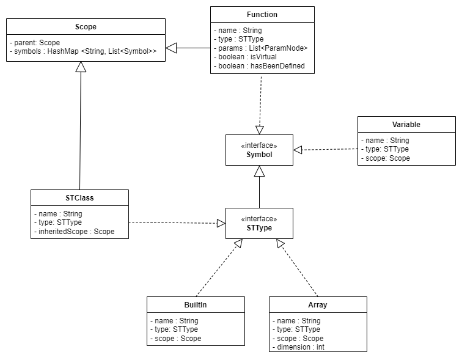
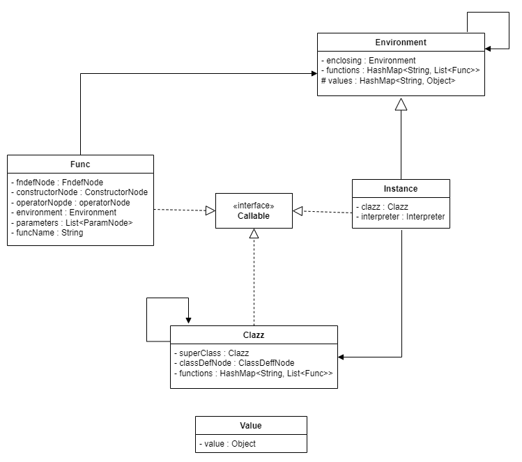

# Cpp-Compiler
---
- [Cpp-Compiler](#cpp-compiler)
  - [Project Overview](#project-overview)
    - [Grammar](#grammar)
    - [Abstract Syntax Tree (AST)](#abstract-syntax-tree-ast)
    - [Symbol Table (ST)](#symbol-table-st)
    - [Interpreter](#interpreter)
  - [Implemented Features](#implemented-features)
    - [Basis Data Types: `bool`, `int`, `char`](#basis-data-types-bool-int-char)
    - [Variables](#variables)
    - [Arrays](#arrays)
    - [C++ References](#c-references)
    - [Assignments and Expressions](#assignments-and-expressions)
    - [Control Flow: `if-then-else`, While Loops](#control-flow-if-then-else-while-loops)
    - [Functions (Definition, Declaration, Calls)](#functions-definition-declaration-calls)
    - [Classes (with Attributes and Methods)](#classes-with-attributes-and-methods)
    - [Single Inheritance](#single-inheritance)
    - [Polymorphism (Dynamic, Static)](#polymorphism-dynamic-static)
    - [Built-in Functions: `print_bool`, `print_int`, `print_char`](#built-in-functions-print_bool-print_int-print_char)
    - [General](#general)
  - [Class Structure](#class-structure)
    - [ASTBuilder.java](#astbuilderjava)
    - [STBuilder.java](#stbuilderjava)
    - [Interpreter.java](#interpreterjava)
---
## Project Overview

This project is a student project that implements a grammar and interpreter for a simplified version of C++. The development process follows four key steps: Grammar, Abstract Syntax Tree (AST), Symbol Table (ST) together with type checking, and finally the Interpreter.

### Grammar
The grammar defines the syntax rules of the language and lays the foundation for parsing the source code. The grammar is responsible for recognizing language constructs and ensuring they adhere to the defined syntax. 

### Abstract Syntax Tree (AST)
The AST is a hierarchical tree representation of the parsed source code. Each node in the AST represents a construct occurring in the source code. This structured representation is crucial for further processing stages like semantic analysis and code generation.

### Symbol Table (ST)
The ST is a data structure that stores information about identifiers (such as variable and function names). It performs semantic checks, ensuring the program adheres to scope rules and type constraints. The ST is crucial for type checking and ensuring that references to variables and functions are valid.

### Interpreter
The interpreter executes the code by traversing the AST and performing the operations defined by the source code. It interprets the program at runtime, facilitating the evaluation of expressions, execution of statements, and management of program state.

---

## Implemented Features

### Basis Data Types: `bool`, `int`, `char`
- **Fully implemented**
- Standard values (`false`, `0`, `''`) are automatically set upon declaration.

### Variables
- **Fully implemented**
- Declaration (with and without assignment)
- Bindings
- Type checking

### Arrays
- **Fully implemented**
- Support for multi-dimensional arrays
- Automatically initialized with null values
- Dimension and type checks upon definition
- Array access checked with a custom `Index out of bounds` error

### C++ References
- **Fully implemented**

### Assignments and Expressions
- Operators `++` and `--` implemented with distinction between pre and post increments
- Various assignment operators (`+=`, `-=`, `*=`, `/=`) implemented
- Arithmetic operations only supported with integers

### Control Flow: `if-then-else`, While Loops
- **Fully implemented**
- `Else if` also possible
- Comparison operators `==` and `!=` implemented, comparisons only with built-in types
- Concatenation of conditions with `&&` and `||` possible

### Functions (Definition, Declaration, Calls)
- **Fully implemented**
- Declaration and subsequent definition
- Overloading supported
- Overriding **only** for `virtual` methods 
    - Pure virtual methods (abstract classes and templates) not implemented
- Optional `override` keyword enforces overriding
- `Return` are statements type-checked but not required in every path of a method

### Classes (with Attributes and Methods)
- **Fully implemented**
- Access to class variables and functions
- Big 3:
    - Standard Constructor: Overloading, calling super constructors, constructor call with parameters supported
    - Copy Constructor: Standard implementation for normal calls, invoked with `A a = b;`, cannot be called with `A a(b)` if not implemented
    - Assignment Operator: Can be overridden, standard implementation provided
- Variables and functions must be declared within the class before use, unlike in C++

### Single Inheritance
- **Fully implemented**
- Constructor of superclasses are called automatically
- Inheritance of functions and attributes
- Overriding functions from all superclasses

### Polymorphism (Dynamic, Static)
- **Fully implemented**, with dynamic and static polymorphism
    - Our output matches the behavior of the standard C++ compiler, differing from the example's behavior.

### Built-in Functions: `print_bool`, `print_int`, `print_char`
- **Fully implemented** as `print`
- New line printed using `'\n'`
- `print_bool()` prints `true` or `false` instead of `0` or `1`

### General
- Interpreter starts only after successful run of the STBuilder (Semantic Analysis)
- Semantic Analysis (Type-checking and symbol table construction) is performed in a single pass

---

## Class Structure

### ASTBuilder.java
**Purpose:** Constructs the AST from the parsed source code.

The `ASTBuilder` class extends the `CppBaseVisitor` to visit different parts of the parsed code and construct corresponding nodes in the AST. Most of the parser rules of our grammar have their own class. All of those classes extend the base ASTNode Class. ParseTree nodes that were not useful for further steps were not implemented as ASTNodes. An example for this process is the `stmt` ParseTree Node. This Node has always on child and could therefor be replaced with an ASTNode of this child.

### STBuilder.java
**Purpose:** Builds the symbol table and performs semantic analysis.
The `STBuilder` class implements `ASTVisitor` to traverse the AST and construct a tree-structured symbol table while performing type checks.

- **Class Structure:**
  - **Symbol**: Represents everything that is stored in the symbol table (Types, Variables, and Functions).
  - **Function**: Represents a function, which is a scope at the same time. The function body and parameters will be handled in the function scope.
  - **Scope**: Stores defined variables, classes, and functions. It has a parent scope, allowing for a tree structure to be built.
  - **STClass**: Stores a class and is an `STType` since classes can also be types. The class content will be handled in the class scope.
  - **Variable**: Stores a variable with its scope, type, and name.
  - **STType**: An interface that represents everything that can be used as a type.
  - **Builtin**: Represents a built-in type such as `int`, `char`, or `bool`.
  - **Array**: Stores an array type with its base type and dimensions.

### Interpreter.java
**Purpose:** Handles the interpretation logic.
The `Interpreter` class is designed to visit nodes of the AST and execute the corresponding operations. It maintains an environment that tracks variable bindings, and function calls.

- **Class Structure:**
  - **Environment**: The `Environment` class stores defined variables, classes, and functions. It has an enclosing scope, allowing for a tree structure to be built.
  - **Func**: The `Func` class can represent an operator, a normal function, or a constructor. It stores the function definition node (`fndefNode`), which allows it to be called when needed.
  - **Callable**: The `Callable` interface is designed for all objects that can be invoked.
  - **Clazz**: The `Clazz` class stores its functions and allows instances to borrow these functions. It maintains a structure of its methods and properties to facilitate this borrowing process.
  - **Instance**: The `Instance` class represents an instance of a class. It borrows functions from its superclass, defines its own attributes at creation, and can be invoked due to the copy constructor.
  - **Value**: The `Value` class is a wrapper around an actual value, enabling the implementation of references.
---
